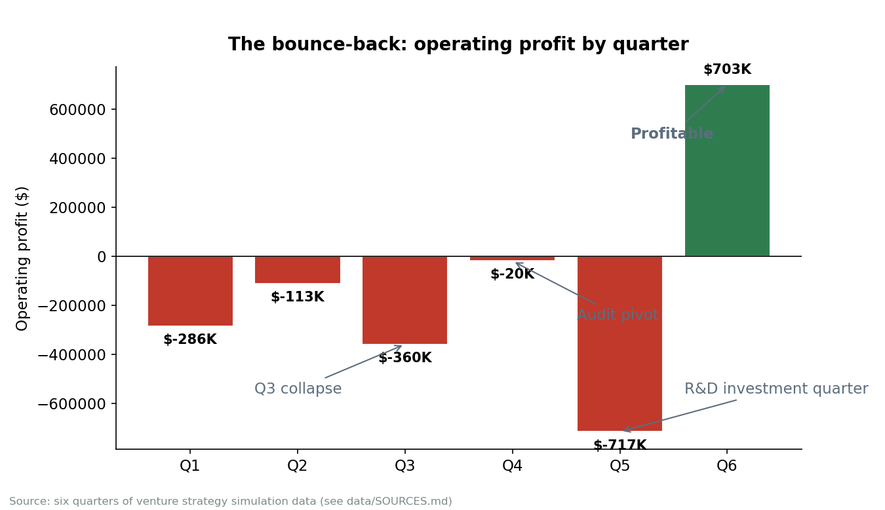
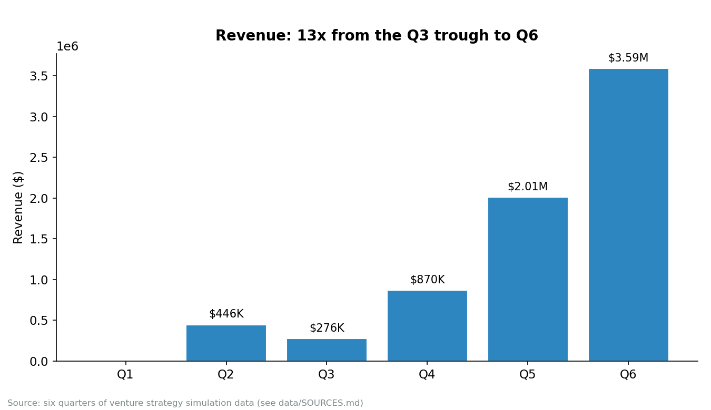
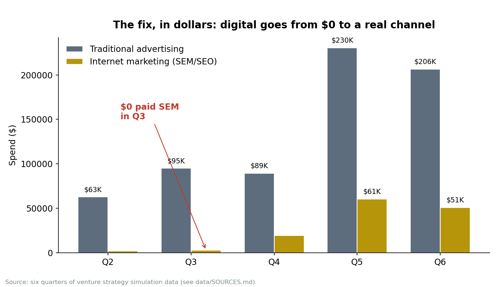
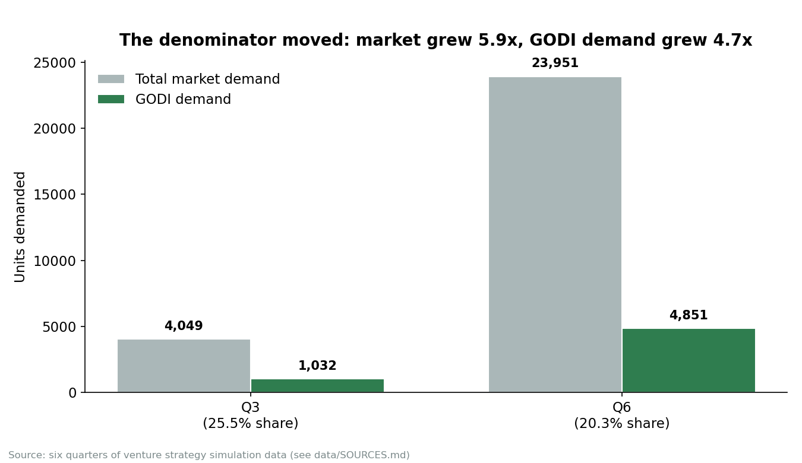
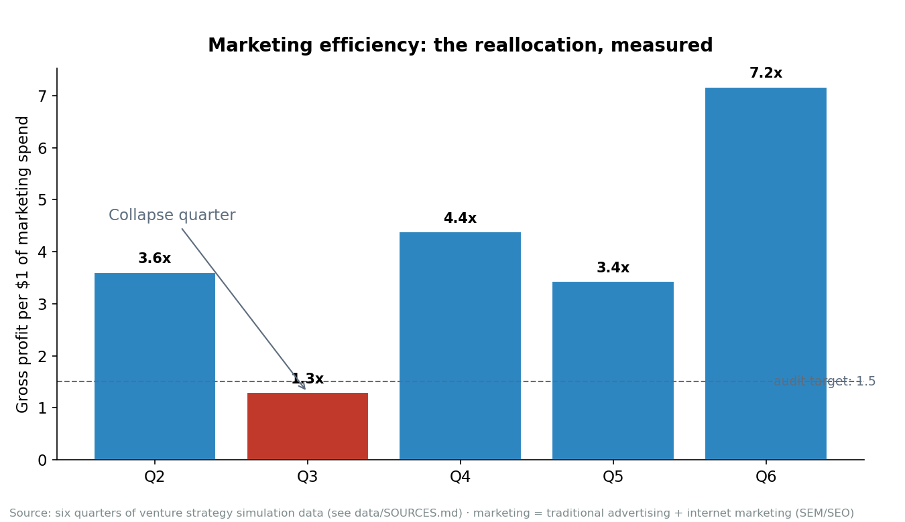

# The Bounce-Back: Diagnosing and Turning Around a Bike Venture

A marketing performance audit that pulled a team out of a Q3 collapse and back to
profitability by Q6. Built from six quarters of a Harvard Business Publishing venture strategy simulation, where I served as VP of Business Analytics and HR.

## The story in 90 seconds

Our team launched an international bike company, placed second after Q1, then
collapsed in Q3: zero paid search, 78% of orders unfulfilled, fragmented messaging, and
the quarter's worst loss (-$360K operating profit). I stayed up and built a full Q3
marketing performance audit: visibility scorecard, segment-by-segment diagnosis, five
root causes, and a corrective Q4 plan with quantified targets. The team executed against
it. Losses nearly vanished in Q4, and by Q6 the company was profitable (+$703K) on
13x the Q3 revenue.

## The warning signs (Q2)

The collapse didn't come out of nowhere. Our Q2 performance review, documented in the team's working notes, closed the quarter at 21.8% total share (Speed 35.9%, Mountain
25.8%, Recreation 6.8%, effectively no presence), trailing Neocarbon's 41.9%. The
review's own weaknesses table named them plainly: Amsterdam-only distribution, no
Recreation line (surrendering 40% of market volume), weak search presence (190 clicks
vs. Neocarbon's 532), a two-bike portfolio against competitors' three. Capacity
utilization was already "High (7/8)", and the Q3 plan called for raising operating
capacity from 7 to 9 units a day "to avoid stock-outs."

The review named the capacity risk and planned the fix. Q3 still delivered 78%
stockouts. That's the detail that sharpens the whole case: diagnosis was never the
scarce resource here. Execution was, which is exactly what the Q4 audit had to solve for.

## The pitch before the fall

The team submitted its VC funding request on October 29, 2025, under deadline pressure: $2.5M to turn a strong test market into a market-shaping brand. The
pitch told the Q2 story at its best: 22% share, second place overall, Speed Star R
taking 36% of its segment, zero stock-outs, top-tier productivity. The money would go
to the Urban Comfort line ($0.6M), marketing and digital ($0.6M), a second store
($0.6M), working capital ($0.2M), and a $0.5M backup budget.

The pitch went out just as the Q3 numbers were coming in. That backup budget line reads differently now. The quarter that followed is exactly what backup budgets are for.

## The collapse (Q3)

The audit found five failures, all in execution. The product was never the problem:

1. **Digital blackout.** $0 in paid search while the closest competitor spent $17K+.
   An estimated 30–40% of high-intent buyers never saw us.
2. **Stockouts with no communication.** 78% of orders unfulfilled, 801 lost sales, and no crisis messaging. A logistics problem became a trust problem.
3. **Weak creative.** Three ads, ten regional placements (competitors ran 20+), every
   ad scoring under 70 on quality.
4. **Fragmented messaging.** Offline said "speed and performance"; online said "urban
   lifestyle." Customers couldn't say what the brand stood for.
5. **Budget misallocation.** $58K overspent on underperforming offline ads, $3K on
   search, $0 on social. ROAS below 1.0.

The sharpest finding: our Recreation line had the market's highest search volume
(1,333 queries) and our worst segment result (-$47K). The biggest opportunity was
sitting under the worst execution.

## The pivot (Q4)

The corrective plan: ~$17.2K in paid search with per-segment bids, one unified tagline
("Ride Confidently, GODI Delivers"), a rebalanced budget (offline $45K / search $17K /
social $10K / SEO $3K), segment-differentiated messaging, and a "we're back" trust
campaign. Target: 15–17% share, marketing ROI above 1.5.

## The bounce-back (Q4–Q6)



Operating profit went from -$360K (Q3) to nearly breakeven in Q4 (-$20K) to +$703K
in Q6. Revenue grew 13x off the Q3 trough.



The fix shipped and kept shipping. Internet marketing spend went from $3K in Q3 to
$19.5K in Q4 to a $50K paid-search budget by Q6, with per-segment max bids in place.



One honest complication: Q5 shows a -$717K loss. That's not a relapse. It's a deliberate $860K R&D investment while revenue kept climbing. The income statement
makes it unambiguous, so the case says so instead of smoothing it over.

And a second complication worth naming: market share (by demand) fell from 25.5% to
20.3%, because the total market grew 5.9x while our demand grew 4.7x. The turnaround
is a profit story inside a share-loss market, which is the more interesting finding and the one a hiring manager can actually interrogate.



The recovery wasn't evenly spread. Demand by segment, Q3 to Q6:

| Segment | Q3 | Q6 | Growth |
|---------|----|----|--------|
| Recreation | 383 | 2,010 | 5.2x |
| Mountain | 186 | 1,337 | 7.2x |
| Speed | 463 | 1,504 | 3.2x |
| **Total** | **1,032** | **4,851** | **4.7x** |

Recreation, the segment the audit flagged as the biggest opportunity under the worst execution, delivered the second-strongest growth. The diagnosis pointed at the right
place.

And the reallocation, measured as gross profit per marketing dollar:



From 1.3x in the collapse quarter to 7.2x by Q6, against the audit's own target of
1.5x. The plan didn't just get executed; it over-delivered on its own terms.

## What I did

As VP of Business Analytics and HR, I sat between the numbers and the people. When
marketing wanted to outspend the problem, I modeled what the spend would actually buy.
When production hesitated to scale, I recalculated capacity and showed the cost of
waiting. The audit turned a room full of opinions into one shared picture of what was wrong, and the team reorganized around it. That's the part of this case I'm proudest
of: the analysis only mattered because it changed what the team did next.

## Method, and why this one

A diagnostic audit: benchmark every marketing dimension against the market, decompose
losses by segment, trace each failure to an organizational root cause, then size a
corrective plan with targets. The question was explanatory ("why are we losing?"), not predictive. An audit with before/after targets was the right tool, and it's what the
team could act on that week. A predictive model would have answered a question nobody
was asking.

## Limitations

- "Market share" appears in two definitions here: the audit's 15–17% target is a
  fulfilled-sales share (~6% in Q3 after stockouts); the report charts show
  demand (orders placed) share. The case keeps them separate.
- Q4 targets are projections with stated assumptions, not observed outcomes.
- Q2 findings come from the team's working notes, not the source reports, sourced as such in `data/SOURCES.md`.

## Data appendix

Quarterly financials (from the Q1–Q6 income statement):

| Q | Revenue | Gross profit | Advertising | Internet marketing | Operating profit |
|---|---------|--------------|-------------|--------------------|------------------|
| 1 | 0 | 0 | 0 | 0 | -286,000 |
| 2 | 446,000 | 233,652 | 62,794 | 2,000 | -112,653 |
| 3 | 276,100 | 126,916 | 95,000 | 3,000 | -359,704 |
| 4 | 869,900 | 477,239 | 89,325 | 19,531 | -19,707 |
| 5 | 2,012,800 | 999,075 | 230,500 | 60,557 | -716,766 |
| 6 | 3,592,650 | 1,845,819 | 206,500 | 50,972 | 702,512 |

Market demand by company and segment (units):

| Q3 | Recreation | Mountain | Speed | Total |
|----|-----------|----------|-------|-------|
| Neocarbon | 558 | 175 | 587 | 1,320 |
| Need4Speed | 408 | 359 | 323 | 1,090 |
| GODI | 383 | 186 | 463 | 1,032 |
| C-LIN3 | 288 | 190 | 129 | 607 |
| **Total** | **1,637** | **910** | **1,502** | **4,049** |

| Q6 | Recreation | Mountain | Speed | Total |
|----|-----------|----------|-------|-------|
| Need4Speed | 1,543 | 3,229 | 2,502 | 7,274 |
| Neocarbon | 2,278 | 1,165 | 2,004 | 6,447 |
| C-LIN3 | 1,273 | 1,991 | 2,115 | 5,379 |
| GODI | 2,010 | 1,337 | 1,504 | 4,851 |
| **Total** | **7,104** | **8,722** | **8,125** | **23,951** |

Machine-readable versions live in `data/`.

## Reproducibility

Numbers are extracted from the source reports into `data/` (see
`data/SOURCES.md` for the full ledger). Charts rebuild with one command:

```
python3 analysis/godi_turnaround.py
```
